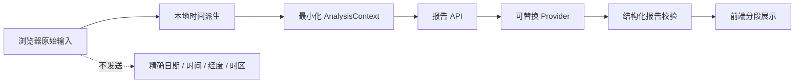

# 识己 · 隐私优先的 AI 性格画像工程范式

这是从一套完整商业应用中抽取、重新整理的公开参考实现，重点展示：如何把“传统文化结构信号 + 自评维度 + AI 报告”做成一条可测试、可替换、默认不需要密钥的产品链路。

> 本仓库只提供产品工程范式，不包含完整商业系统、真实用户数据或生产方法论。输出仅用于自我反思与软件演示，不构成医疗、心理、法律、财务或其他专业建议。

## 大概思路

核心原则是：**先在浏览器本地派生和最小化，再把必要结构发送给服务端。**



当前 Demo 会在浏览器内把精确时间与位置转换成：

- `solarBranch`：0–11 的派生时辰索引；
- `nearTimeBoundary`：是否靠近时间边界；
- 四个 1–5 分的自评维度。

API 只接受这份固定 schema，并拒绝姓名、联络资料、精确出生数据或其他额外字段。

## 公开内容

| 模块 | 作用 |
|---|---|
| `lib/solar-time.ts` | 时区、经度、均时差和真太阳时派生纯函数 |
| `lib/privacy.ts` | 原始输入校验、数据最小化、服务端严格 schema 校验 |
| `lib/pipeline.ts` | 可恢复的报告任务状态机、Prompt 蓝图和输出安全校验 |
| `lib/demo-provider.ts` | 无网络、无密钥的离线 Demo Provider |
| `app/api/demo-report` | 不记录原始数据的最小报告 API |
| `app/page.tsx` | 水墨纸张风格的交互表单、进度和结构化报告 UI |
| `tests/` | 时间派生、隐私边界、状态机和报告测试 |

仓库可以直接运行，不需要数据库、激活码、Webhook 或 AI API Key。

## 不公开的生产边界

以下内容有意排除：

- 完整排盘引擎、星曜知识库和商业分析方法论；
- 生产 Prompt、模型选择、长报告编排和质量评估规则；
- 激活码、支付、用户账户、JWT、管理员和配额系统；
- MongoDB、异步 Worker、断点续跑和生产部署配置；
- 真实用户输入、报告、追问记录、运营文案和销售渠道；
- 域名、服务器地址、账号、密钥、联络资料及个人经历。

因此，这个仓库适合学习架构和构建原型，而不是完整产品的源码镜像。

## 快速开始

需要 Node.js 20.9 或更高版本。

```bash
npm install
npm run dev
```

打开 `http://localhost:3000`。

验证项目：

```bash
npm test
npm run typecheck
npm run build
```

## 目录结构

```text
app/
├── api/demo-report/route.ts   # 严格最小输入的演示 API
├── globals.css                # 宣纸、水墨、朱砂视觉系统
├── layout.tsx
└── page.tsx                   # 客户端本地派生与报告展示

lib/
├── demo-provider.ts           # 离线 Mock 报告生成
├── pipeline.ts                # 状态机、Prompt 蓝图、报告校验
├── privacy.ts                 # 最小化与服务端输入白名单
├── solar-time.ts              # 纯函数时间派生
└── types.ts                   # 输入、上下文与报告 schema

tests/
├── pipeline.test.ts
├── privacy.test.ts
└── solar-time.test.ts
```

## 隐私设计

| 风险 | 当前范式的处理 |
|---|---|
| 原始出生信息被上传 | 浏览器本地派生，API 不接受原始字段 |
| API 被偷偷追加个人字段 | 服务端使用字段白名单，出现额外字段立即拒绝 |
| 错误响应回显输入 | API 只返回通用错误，不回显请求内容 |
| 第三方模型收集数据 | 默认 Provider 完全离线，不访问第三方 |
| 报告作出绝对或专业判断 | 输出校验拒绝宿命论及医疗式表述 |
| 日志或缓存残留 | API 响应使用 `Cache-Control: no-store`，示例不写数据库 |

生产环境仍应补充明确同意、数据保留期限、删除接口、传输加密、审计日志脱敏和供应商数据处理协议。

## 接入真实 AI Provider

推荐保留 `AnalysisContext → PersonalityReport` 边界，而不是让页面直接拼接任意 Prompt：

```ts
interface ReportProvider {
  generate(context: AnalysisContext): Promise<PersonalityReport>
}
```

生产实现建议：

1. 在服务端读取密钥，绝不发送给浏览器；
2. 只把最小化后的 `AnalysisContext` 交给模型；
3. 为请求设置超时、重试、并发限制和幂等键；
4. 用结构化输出 schema 校验模型结果；
5. 在保存前再次做隐私和内容安全过滤；
6. 记录阶段、耗时和错误类型，不记录原始用户输入。

## 从范式走向完整产品

可以按以下顺序扩展：

1. **Provider 层**：接入一个支持结构化输出的模型供应商；
2. **任务层**：将长报告生成放入队列，前端轮询或使用 SSE 获取进度；
3. **存储层**：只保存必要派生数据，字段加密并提供用户删除能力；
4. **账户层**：采用成熟认证方案，不从出生信息推导密码；
5. **质量层**：增加事实边界、反宿命论、前后矛盾和重复度检查；
6. **运营层**：把激活码、支付、配额和后台管理与报告核心解耦；
7. **可观测性**：用匿名请求 ID 跟踪阶段和成本，不记录报告正文。

## 安全检查

提交前至少执行：

```bash
git grep -n -I -E "(password|secret|token|api[_-]?key|webhook|private[_-]?key)"
git status --short
```

请勿提交 `.env`、激活码、用户导出、报告、数据库连接串、服务器地址或部署日志。

## 许可证

[MIT](LICENSE)
